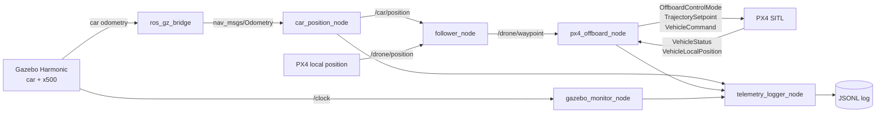

# Architecture

The car uses Gazebo's dedicated odometry-publisher system; the follower has no direct Gazebo API or model-state access. It consumes only `/car/position`, validates that stream, and publishes `/drone/waypoint`. The PX4 node is the sole owner of flight-state transitions and ENU/NED conversion.
